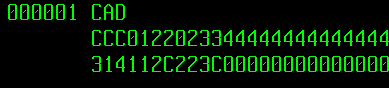

# Première partie DB2

## Table of Contents
- [01 - Preparation](#01)
- [02 - Programme COBOL](#02)

## 01 - Preparation <a name = "01"></a>

### a) Préparation de votre Fichier d'entrée

Ici, le format des valeurs est assez compliqué à manipuler manuellement.   
  
Alors il vous faudra utiliser FileManager pour générer votre Fichier d'Update.
Sinon, voici un fichier conforme (il devrait paraitre un peu corrumpu...) :  
<a href="./01 - FILE016">01 - FILE016</a>

### b) Préparation de votre Database SQL

Il faut egalement préparer la Database à modifier, voici un exemple qu'il vous suffira de ```SUBMIT``` en JCL  
<a href="./01 - SQL EXE4.jcl">01 - SQL EXE4.jcl</a>


## 02 - Programme COBOL <a name = "02"></a>

Le programme COBOL pour UPDATE la table TBDEVISE avec les valeurs du fichier.    
<a href="./02 - PGM016.cbl">02 - PGM016.cbl</a>

## Suite

Je vous ai également mis les instructions JCL pour la compilation, le binding et l'execution. N'oubliez pas de modifier les parametres.

